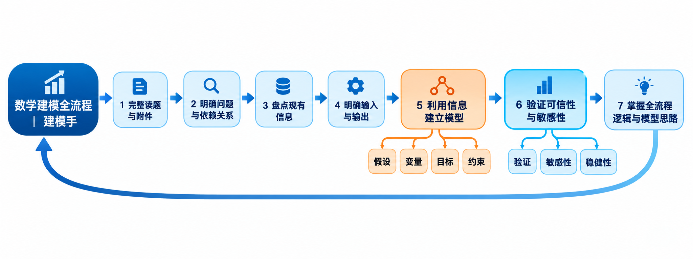

# CUMCM Modeling Lead：轻量竞赛级全队建模

面向全国大学生数学建模竞赛（CUMCM）的全队一体化 Agent Skill。它把“全队能讲清、能复现”的协作优势，与“主方案优先、结果优先”的竞赛节奏结合起来；默认保持轻量，需要正式留痕时再开启严格模式。

> 本项目用于竞赛训练和队内协作。参赛时应以当届官方规则为准，队员必须理解、核验并负责最终模型、代码、论文和 AI 使用披露。



## 核心目标

- 完整读取题面和附件，明确每一问及其依赖关系；
- 区分题目事实、数据发现、领域依据、建模假设、设计选择和未知项；
- 建立可追溯的假设—变量—方程—目标—约束逻辑链；
- 限时比较主方案、强备选和低成本审计基线，优先推进最适配且能稳定跑通的主方案；
- 所有正式数值来自真实运行，并记录输入、代码、参数、种子、输出和哈希；
- 独立检查数据、公式、量纲、泄漏、约束、边界、敏感性和稳健性；
- 论文只引用已经冻结的结果和图表；
- 检查摘要、正文、表格、图片、结论、附录和支撑材料的一致性。

## 全流程

```text
题面与附件
→ 全题拆解与依赖图
→ 事实、假设、变量、目标和约束
→ 限时选定主方案与强备选
→ 主方案最小闭环
→ 低成本基线审计
→ 主方案全量计算
→ 独立验证与敏感性分析
→ 结果、图表和结论冻结
→ 论文装配
→ 一致性与评委终审
→ 提交包复核
```

权威证据链：

```text
Requirement → Model Contract → Run → Result → Figure → Claim → Paper
```

## 三人分工

| 角色 | 负责内容 | 核心交付 |
|---|---|---|
| 建模手 | 题意、依赖关系、假设、变量、公式、目标、约束、选模和结论边界 | `建模总控.md`、`模型合同.md`、`术语与符号表.md` |
| 编程手 | 数据检查、主方案原型、低成本基线、全量计算、验证、敏感性和图表数据 | 代码、Run、Result、诊断和复现入口 |
| 论文手 | 根据冻结证据写作、制图、排版、编译和一致性检查 | 论文、图表、表格、引用和提交包 |

独立验证是一个职责，可以由未参与当前部分的队员承担。验证者默认怀疑主方案，不能用润色掩盖数据、模型或证据问题。

## 安装

### 使用 Codex Skill Installer

在 Codex 中发送：

> 请使用 skill-installer 从 GitHub 仓库 `gift-maker/Enabling-Skill-` 的 `skills/cumcm-modeling-lead` 路径安装这个 Skill。

安装后新建任务，或在下一轮明确调用：

> 使用 `$cumcm-modeling-lead` 分析这道国赛题。先拆清全题依赖并限时选定主方案，立即跑通主方案最小闭环；用低成本基线审计后推进全量计算，并交付全队能复述、可复现、可验证的结果包。

### 手动安装

将整个目录：

```text
skills/cumcm-modeling-lead
```

复制到：

```text
%USERPROFILE%\.codex\skills\cumcm-modeling-lead
```

必须复制整个目录，不能只复制 `SKILL.md`。

## 第一次使用

初始化比赛项目：

```powershell
python skills/cumcm-modeling-lead/scripts/init_competition_project.py `
  D:/cumcm/projects/2026-C `
  --competition CUMCM `
  --problem C
```

初始化后会生成：

```text
2026-C/
├── 题面与附件/
├── 数据/
├── 建模与代码/
├── 结果/
├── 论文/
├── 全队建模记录.md
└── AI使用记录.md
```

默认模式只建立赛时真正需要的共享结构。正式训练、关键结果冻结或需要完整审计时，在命令末尾添加 `--strict`，额外建立运行记录、结果记录、图表记录、论文结论记录和项目状态。

## 严格模式：真实运行记录

以下工具用于 `--strict` 项目；默认轻量模式不要求每次试算都登记。

使用统一入口执行模型：

```powershell
python skills/cumcm-modeling-lead/scripts/record_run.py `
  --root D:/cumcm/projects/2026-C `
  --question Q1 `
  --purpose main-prototype `
  --status candidate `
  --input 数据/data.csv `
  --code 建模与代码/q1.py `
  --output 结果/q1.csv `
  -- python 建模与代码/q1.py
```

工具会生成唯一 `run_id`，保存日志，并记录输入、代码和输出的 SHA-256。

独立验证完成后，带验证证据更新状态：

```powershell
python skills/cumcm-modeling-lead/scripts/update_evidence_status.py `
  --root D:/cumcm/projects/2026-C `
  --registry run `
  --id R001 `
  --field validation_status `
  --value passed `
  --evidence 结果/Q1验证报告.md
```

## 严格模式：证据登记账

| 文件 | 用途 |
|---|---|
| `run_ledger.csv` | 记录计算命令、输入、代码、参数、输出和运行状态 |
| `result_registry.csv` | 记录可引用结果、单位、场景、来源 Run 和验证状态 |
| `claim_ledger.csv` | 记录论文核心结论及其结果、图表、公式或来源证据 |
| `figure_evidence.csv` | 记录图表文件、源数据、生成脚本、结论和视觉检查 |
| `issue_ledger.csv` | 记录 P0–P3 问题、修复责任人和状态 |

程序成功运行不代表模型有效；图表成功导出不代表可以写进论文；文字表达流畅不代表结论有证据。

## 终稿证据门

终稿前运行：

```powershell
python skills/cumcm-modeling-lead/scripts/audit_evidence.py `
  D:/cumcm/projects/2026-C `
  --require-final
```

以下情况会被阻塞：

- 没有真实运行记录；
- 正式结果没有 `run_id` 或来源文件；
- 对应运行失败或尚未独立验证；
- 论文主张没有结果、图表、公式或来源支持；
- 正式图表没有源数据、生成脚本或视觉检查；
- 结论引用尚未冻结的结果；
- 存在开放的 P0/P1 问题。

## 模型选择与组合

每问默认建立三层路线：

- **主方案：**最适配题目关键结构，且能在赛时稳定跑通；
- **强备选：**假设或求解路线不同，用于主方案失败、对照或稳健性检查；
- **低成本审计基线：**手算、规则法、松弛模型、短时限求解或多情景复算，用来发现主方案错误，不与主方案平分计算预算。

主方案先跑最小闭环，再做低成本基线审计，然后进入全量计算。通常基线只占总计算预算的 10% 以内；只有证据表明路线有问题时，才切换强备选或让基线承担完整求解。

支持预测→优化、机制+数据、并行比较、集成预测、分层模型、评价→决策等组合。模型组合必须明确输入输出接口，并传播上游误差。遗传算法、粒子群等属于求解方法，不能代替数学模型。

## 可选验证工具

基础依赖见 `requirements.txt`。按题目需要安装：

```powershell
pip install -r skills/cumcm-modeling-lead/requirements-validation.txt
```

可选工具包括：

- Pandera：数据字段、类型、范围和唯一性检查；
- SymPy：表达式等价、符号推导和解回代；
- SALib：Morris、Sobol、FAST 等敏感性分析；
- Pint：单位与量纲；
- uncertainties：不确定性传播。

这些工具只能检查各自覆盖的部分，不能自动证明整个现实模型正确。

## Skill 结构

```text
skills/cumcm-modeling-lead/
├── SKILL.md
├── README.md
├── references/
├── assets/
├── scripts/
├── tools/
├── agents/
├── requirements.txt
└── requirements-validation.txt
```

主要入口：

- [`SKILL.md`](skills/cumcm-modeling-lead/SKILL.md)
- [`全队一体化工作流`](skills/cumcm-modeling-lead/references/全队一体化工作流.md)
- [`证据链与独立验证`](skills/cumcm-modeling-lead/references/证据链与独立验证.md)
- [`模型选择与整合协议`](skills/cumcm-modeling-lead/references/模型选择与整合协议.md)
- [`论文与图表证据协议`](skills/cumcm-modeling-lead/references/论文与图表证据协议.md)
- [`第三方来源与整合说明`](skills/cumcm-modeling-lead/references/第三方来源与整合说明.md)

## 验证状态

本地已完成：

- Skill 结构校验；
- Python 源码语法检查；
- Markdown 相对链接检查；
- 项目初始化测试；
- 真实运行与 SHA-256 记录测试；
- 未验证结果阻塞测试；
- 终稿证据门通过测试；
- ZIP 内容与缓存残留检查。

许可证、原始基础框架和参考项目见 [`CREDITS.md`](skills/cumcm-modeling-lead/CREDITS.md) 与 Skill 内各第三方组件的许可证文件。
