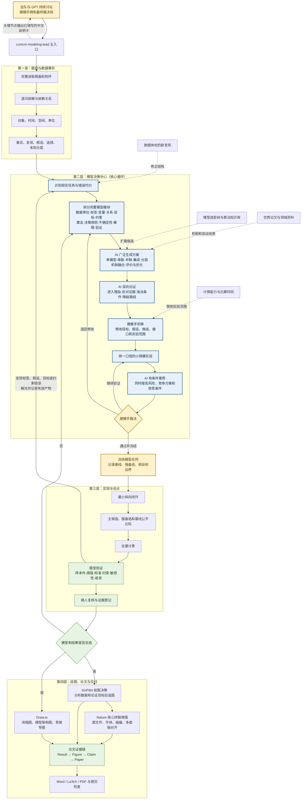
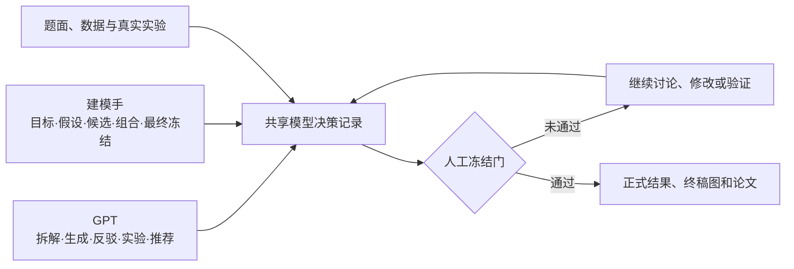
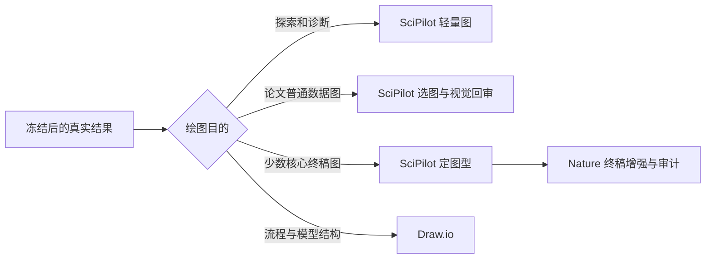

# 国赛建模 Skill 整体架构图

该图对应当前 `cumcm-modeling-lead` 架构，可由 GitHub 直接渲染。

```mermaid
flowchart TB
    U["全队与 GPT 持续讨论<br/>建模手拥有最终裁决权"] --> E["cumcm-modeling-lead 主入口"]

    subgraph L1["第一层：题目与数据事实"]
        A1["完整读取题面和附件"] --> A2["逐问拆解与依赖关系"]
        A2 --> A3["对象、时间、空间、单位"]
        A3 --> A4["事实、发现、假设、选择、未知分层"]
    end
    E --> A1
    A4 --> M0

    subgraph MC["第二层：模型决策中心（核心循环）"]
        M0["识别现实任务与错误代价"]
        M1["拆分完整模型模块<br/>数据单位·标签·变量·关系·目标·约束<br/>算法·决策规则·不确定性·解释·验证"]
        M2["AI 广泛生成方案<br/>单模型·串联·并联·集成·分层<br/>机制融合·评价与优化"]
        M3["AI 双向论证<br/>进入理由·反对证据·淘汰条件·降级路线"]
        M4["建模手初审<br/>修改目标、假设、候选、接口和实验范围"]
        M5["统一口径的小规模实验"]
        M6["AI 有条件推荐<br/>同时报告风险、竞争方案和改变条件"]
        M7{"建模手裁决"}
        M0 --> M1 --> M2 --> M3 --> M4 --> M5 --> M6 --> M7
        M7 -->|"退回修改"| M1
        M7 -->|"继续验证"| M5
    end

    K1["模型选型树与算法知识库"] -. "扩展候选" .-> M2
    K2["优秀论文与领域资料"] -. "机制和验证线索" .-> M2
    K3["计算能力与比赛时间"] -. "限制实验范围" .-> M4
    K4["数据体检的新发现"] -. "修正结构" .-> M0

    M7 -->|"通过并冻结"| F0["冻结模型合同<br/>记录基线、强备选、假设和边界"]

    subgraph L3["第三层：实现与验证"]
        C1["最小纵向闭环"] --> C2["主候选、强备选和基线公平比较"]
        C2 --> C3["全量计算"]
        C3 --> C4["题型验证<br/>样本外·阈值·校准·约束·敏感性·收敛"]
        C4 --> C5["换人复核与证据登记"]
    end
    F0 --> C1
    C4 -->|"发现标签、假设、目标或约束错误<br/>解冻并记录失效产物"| M0

    C5 --> R0{"模型和结果是否冻结"}
    R0 -->|"否"| M1

    subgraph L4["第四层：绘图、论文与交付"]
        P1["SciPilot 绘图决策<br/>分析数据和论证目标后选图"]
        P2["Nature 核心终稿增强<br/>源文件、字体、碰撞、多面板对齐"]
        P3["Draw.io<br/>流程图、模型架构图、思维导图"]
        P4["论文证据链<br/>Result → Figure → Claim → Paper"]
        P5["Word / LaTeX / PDF 与提交检查"]
        P1 --> P2
        P1 --> P4
        P2 --> P4
        P3 --> P4
        P4 --> P5
    end
    R0 -->|"是"| P1
    R0 -->|"是"| P3
    E -. "关键节点输出已填写的中文说明卡" .-> U

    classDef core fill:#e8f1fb,stroke:#286090,stroke-width:2px,color:#102a43;
    classDef human fill:#fff2cc,stroke:#b8860b,stroke-width:2px,color:#4d3b00;
    classDef evidence fill:#e7f4e4,stroke:#3d7a3a,color:#183b16;
    class M0,M1,M2,M3,M4,M5,M6 core;
    class U,M7,F0 human;
    class C4,C5,R0,P4 evidence;
```

## 人机权限

```mermaid
flowchart LR
    AI["GPT<br/>拆解·生成·反驳·实验·推荐"] --> D["共享模型决策记录"]
    H["建模手<br/>目标·假设·候选·组合·最终冻结"] --> D
    DATA["题面、数据与真实实验"] --> D
    D --> G{"人工冻结门"}
    G -->|"未通过"| BACK["继续讨论、修改或验证"]
    BACK --> D
    G -->|"通过"| OUT["正式结果、终稿图和论文"]
```

## 绘图路由

```mermaid
flowchart LR
    R["冻结后的真实结果"] --> Q{"绘图目的"}
    Q -->|"探索和诊断"| S1["SciPilot 轻量图"]
    Q -->|"论文普通数据图"| S2["SciPilot 选图与视觉回审"]
    Q -->|"少数核心终稿图"| S3["SciPilot 定图型"]
    S3 --> N["Nature 终稿增强与审计"]
    Q -->|"流程与模型结构"| D["Draw.io"]
```
